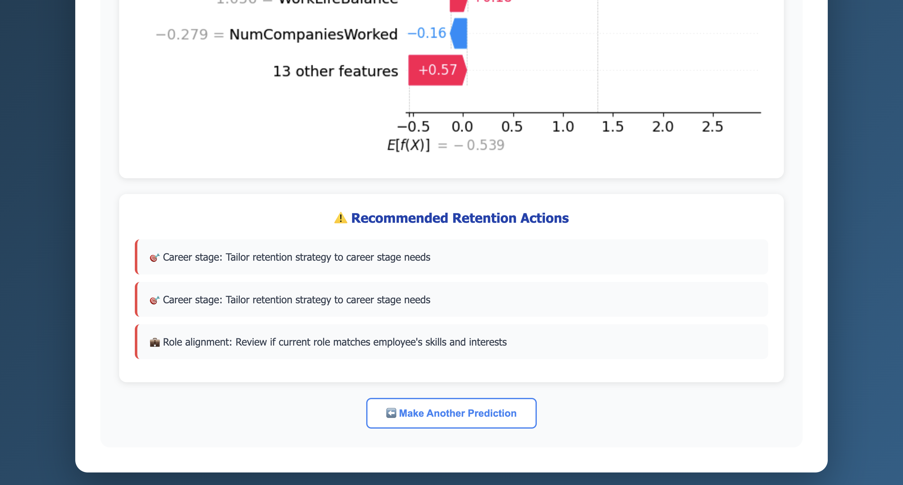

# 🎯 Employee Attrition Prediction System

An AI-powered web application that predicts employee turnover risk using machine learning and provides actionable retention recommendations with SHAP explainability.


---

## 📊 Demo

**🌐 Live Demo:** https://employee-attrition-predictor-noty.onrender.com
(Note: may take ~60 seconds to load due to server idle timeout)

---
## 📝 Note

This project demonstrates an employee attrition prediction system I originally developed for a hospitality business to analyse and predict staff turnover trends.  
This public version uses the IBM HR Analytics dataset from Kaggle to protect client confidentiality, but replicates the same workflow, logic, and deployment process.

---

### Screenshots

**Main Interface:**


**Prediction Results with SHAP Analysis:**


**Retention Recommendations:**


---

## ✨ Features

- 🤖 **ML-Powered Predictions** - Logistic Regression model trained on HR analytics data
- 📊 **SHAP Explainability** - Visual breakdown of factors influencing predictions
- 💡 **Smart Recommendations** - Actionable retention strategies based on risk factors
- 🎨 **Modern UI** - Clean, responsive web interface
- 📈 **27 Features** - Comprehensive employee data analysis
- ⚡ **Real-time Results** - Instant predictions with probability scores

---

## 🚀 Quick Start

### Prerequisites
- Python 3.9+
- pip

### Installation

1. **Clone the repository**
```bash
git clone https://github.com/iamedobor/employee-attrition-predictor.git
cd employee-attrition-predictor
```

2. **Install dependencies**
```bash
pip install -r requirements.txt
```

3. **Run the application**
```bash
python app.py
```

4. **Open in browser**
```
http://localhost:5000
```

---

## 📁 Project Structure
```
employee-attrition-predictor/
├── .python-version
├── .gitignore
├── runtime.txt
├── render.yaml
├── README.md
├── requirements.txt
├── app.py
├── templates/
│   └── index.html
├── models/
│   ├── attrition_model.pkl
│   ├── scaler.pkl
│   ├── label_encoders.pkl
│   ├── feature_names.pkl
│   ├── shap_explainer.pkl
│   ├── numerical_cols.pkl
│   ├── categorical_cols.pkl
│   └── metadata.pkl
├── training/
│   ├── notebooks/
│   │   └── Employee Attrition Prediction System.ipynb
│   └── data/
│       └── IBM HR Analytics Dataset.csv
└── docs/
    └── screenshots/
        ├── interface.png
        ├── prediction.png
        └── recommendations.png

```

---

## 🧠 Model Details

### Algorithm
- **Model**: Logistic Regression with balanced class weights
- **Features**: 27 features (reduced from 30 via correlation analysis)
- **Training Data**: IBM HR Analytics dataset

### Performance Metrics
- **Recall**: 78.72% (effectively catches most at-risk employees)
- **F1 Score**: 0.53
- **AUC-ROC**: 0.81

### Feature Categories
1. **Personal**: Age, Gender, Marital Status, Distance From Home
2. **Job Details**: Department, Role, Business Travel, Overtime
3. **Compensation**: Monthly Income, Salary Hike, Stock Options
4. **Satisfaction**: Job, Environment, Work-Life Balance
5. **Career**: Years at Company, Time Since Promotion, Training

---

## 🎯 How It Works

1. **Input**: Enter employee data through the web form
2. **Prediction**: ML model analyzes 27 features
3. **SHAP Analysis**: Explains which factors drive the prediction
4. **Recommendations**: Provides targeted retention strategies

---

## 🔍 SHAP Explainability

The system uses SHAP (SHapley Additive exPlanations) to show:
- Which features increase attrition risk (red bars →)
- Which features promote retention (blue bars ←)
- The magnitude of each feature's impact
- Overall prediction confidence

---

## 💡 Sample Predictions

### High-Risk Employee
- Young, single, works overtime
- Low satisfaction scores
- Multiple previous employers
- **Result**: High likelihood to leave
- **Recommendation**: Address workload, compensation review

### Low-Risk Employee  
- Married, experienced, no overtime
- High satisfaction, good income
- Long tenure, recent promotion
- **Result**: High likelihood to stay
- **Success Factors**: Maintain current benefits

---

## 🛠️ Technology Stack

**Backend:**
- Flask 3.0.0
- scikit-learn 1.5.1
- SHAP 0.44.1
- pandas, numpy

**Frontend:**
- HTML5, CSS3
- Vanilla JavaScript
- Responsive design

**Deployment:**
- Render (recommended)
- cPanel compatible

---

## 📚 Training the Model

The training notebook is located in `training/notebooks/Employee Attrition Prediction System.ipynb`

**Pipeline includes:**
1. Data Loading & Exploration
2. Feature Engineering
3. Model Training (Logistic Regression, Random Forest, XGBoost)
4. Model Evaluation
5. SHAP Analysis

To retrain the model:
```bash
jupyter notebook training/notebooks/
```

---

## 🚀 Deployment

### Deploy to Render (Free)

1. Push to GitHub
2. Sign up at [Render](https://render.com)
3. Connect your repository
4. Deploy automatically from `render.yaml`
5. Get your live URL!

---

## 🤝 Contributing

Contributions are welcome! Feel free to:
1. Fork the repository
2. Create a feature branch
3. Submit a pull request

---

## 📝 License

This project is open source and available under the MIT License.

---

## 👤 Author

**Osasere Edobor**
- GitHub: [@iamedobor](https://github.com/iamedobor)
- Portfolio: [Osasere Edobor](https://portfolio.edoborosasere.com)
- LinkedIn: [Osasere Edobor](https://linkedin.com/in/osasere-edobor)
- Email: projects@edoborosasere.com

---

## 🙏 Acknowledgments

- Dataset: [IBM HR Analytics Employee Attrition & Performance](https://www.kaggle.com/datasets/pavansubhasht/ibm-hr-analytics-attrition-dataset)
- SHAP Library: [Scott Lundberg](https://github.com/slundberg/shap)

---

⭐ If you find this project useful, please consider giving it a star!